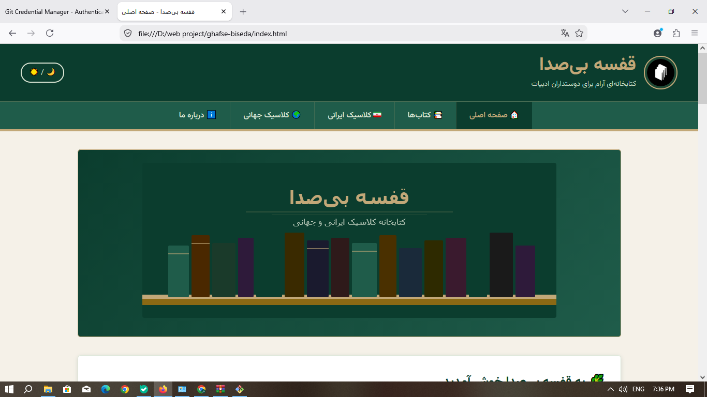

📚 Silent Shelf | قفسه بی‌صدا

A clean Persian RTL digital bookshelf featuring Iranian and world classics, built with HTML, CSS, JavaScript, and Vazirmatn.

قفسه بی‌صدا یک کتابخانه دیجیتال فارسی و راست‌چین است که با هدف نمایش منظم و زیبا‌ی کتاب‌ها و آثار کلاسیک ایرانی و جهان طراحی شده است.

---

🌐 Live Demo

👉 "View Live Website" (https://shabnamnoori.github.io/silent-shelf/)

نسخه آنلاین پروژه از طریق GitHub Pages در دسترس است.

---

🖼️ Project Preview

---

✨ Features

- 📚 Digital bookshelf interface
- 🇮🇷 Iranian classics section
- 🌍 World classics section
- 📖 Books section
- ℹ️ About page
- 📱 Persian RTL interface
- 🎨 Clean and simple visual design
- 🔤 Persian typography using Vazirmatn
- ⚡ Interactive elements using JavaScript

---

🛠️ Technologies

- HTML5
- CSS3
- JavaScript
- Vazirmatn Font

---

📁 Project Structure

silent-shelf/
│
├── images/
├── about.html
├── books.html
├── index.html
├── iranian-classics.html
├── world-classics.html
├── script.js
├── style.css
├── Screenshot.png
└── README.md

---

🎨 Design

The project uses a Persian RTL (Right-to-Left) layout with a clean, simple, and book-oriented visual design.

این پروژه با رابط کاربری فارسی و راست‌چین طراحی شده و تمرکز آن بر خوانایی، سادگی و تجربه‌ای مناسب برای یک کتابخانه دیجیتال است.

---

🌐 Language

Persian (فارسی)

---

📌 Project Type

Frontend Web Project

---

👩🏻‍💻 Author

Shabnam Noori

---

⭐ If you like this project, feel free to explore the repository.

قفسه بی‌صدا — جایی برای کتاب‌هایی که آرام حرف می‌زنند.
